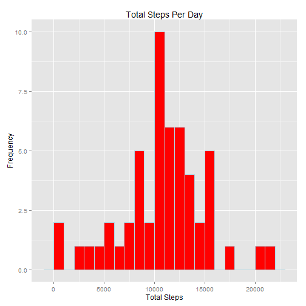
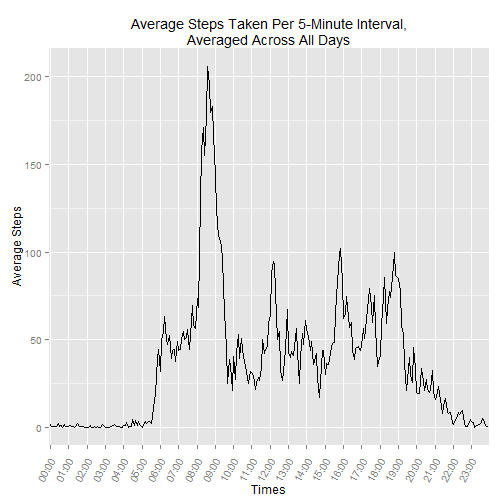
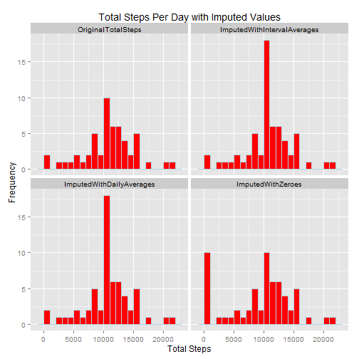
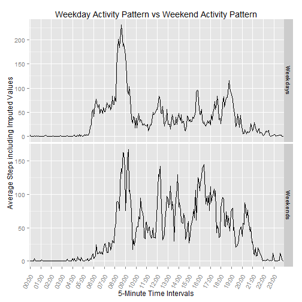

***


Processing date/time is Sat Apr 18 5:04:04 PM 2015.

**Required Libraries**


```r
library(knitr)          ## Required to set opts_chunk within this document
library(ggplot2)        ## Graphing tools
library(scales)         ## Used for time axis ticks in ggplot2
library(reshape2)       ## Used to melt dataset for ggplot2 facets
```

**Global Options**


```r
opts_chunk$set(echo=TRUE, results="asis")
```

## Loading and preprocessing the data


```r
srcfile <- "https://d396qusza40orc.cloudfront.net/repdata%2Fdata%2Factivity.zip"
zipfile <- "activity.zip"
csvfile <- "activity.csv"
if(!file.exists(csvfile) | !file.exists(zipfile)) {
        setInternet2(TRUE)  ## Windows systems only
        download.file(srcfile, zipfile, mode="wb")
        unzip(zipfile)
}
print(downloadtime <- file.info(zipfile)$mtime)
```

[1] "2015-04-08 02:19:34 EDT"

- The source file was downloaded from **https://d396qusza40orc.cloudfront.net/repdata%2Fdata%2Factivity.zip** on **2015-04-08 02:19:34**.


```r
dat <- read.csv(csvfile)
```


## What is mean total number of steps taken per day?

Per the assignment instructions, we will ignore NAs for this step.  We will calculate and plot the distribution of the total steps taken each day. 


```r
dat2 <- dat[!is.na(dat$steps),] 
dsum <- aggregate(dat2$steps, list(dat2$date), sum)
colnames(dsum) <- c("Date", "TotalSteps")
```


```r
ggplot(dsum, aes(x=TotalSteps)) + 
        geom_histogram(binwidth=1000, col="lightblue", fill="red") +
        ggtitle("Total Steps Per Day") + 
        xlab("Total Steps") + ylab("Frequency")
```

 

Calculate the mean and median of the above distribution.


```r
print(mean(dsum$TotalSteps))
```

[1] 10766.19

```r
print(median(dsum$TotalSteps))
```

[1] 10765


## What is the average daily activity pattern?

Again, we will ignore NA values for this step.  We will calculate the average number of steps taken during each interval.  


```r
dat2 <- dat[!is.na(dat$steps),]
davg <- aggregate(dat2$steps, list(dat2$interval), mean)
colnames(davg) <- c("interval", "AverageSteps")
```

Format intervals to show as time slots.


```r
davg$Times <- sprintf("%02d:%02d",floor(davg$interval/100), davg$interval%%100)
```

Plot the average steps per interval period to reveal the daily activity pattern.


```r
ggplot(davg, aes(x=Times, y=AverageSteps, group=1)) + geom_line() +
        scale_x_discrete(breaks=c(davg[grep(":00", davg$Times),]$Times)) +
        theme(axis.text.x=element_text(angle=60, hjust=1.2 )) +
        ggtitle("Average Steps Taken Per 5-Minute Interval,\nAveraged Across All Days") + 
        xlab("Times") + 
        ylab("Average Steps")
```

 

Show the time interval during which the maximum number of steps was taken.


```r
print(maxsteps <- max(davg$AverageSteps))
```

[1] 206.1698

```r
print(avgmax <- davg[davg$AverageSteps==max(davg$AverageSteps),]$Times)
```

[1] "08:35"

- The maximum number of steps, **206.1698113**, occurred during the 5-minute interval of **08:35**.

## Imputing missing values


```r
sprintf("%d NAs were found in the original dataset", sum(is.na(dat$steps)))
```

[1] "2304 NAs were found in the original dataset"

There are 2304 existing in the dataset.  Because NAs are often troublesome, we are assigned the task of imputing data to replace the NAs.  My strategy is to first see what method will make sense by visualizing several different methods (see plot below).  From this analysis, we can see that there are two methods of imputing that would be reasonable.  These methods are using "average by day"" or "average by interval". I will use the "average by interval" after showing each of the different options.


```r
# Create new dataseet to include imputed values
idat <- dat

# Impute using average for that 5-minute interval
avg_by_interval <- sapply(split(dat2$steps, dat2$interval), mean) 
idat$impbyint <- ifelse(!is.na(idat$steps), idat$steps, avg_by_interval[as.character(idat$interval)])

# Impute using average for that day (or use avg if no entries for that day)
avg_by_day      <- sapply(split(dat2$steps, dat2$date), mean)
avg_by_day[is.na(avg_by_day)] <- mean(avg_by_day, na.rm=TRUE)
idat$impbyday <- ifelse(!is.na(idat$steps), idat$steps, avg_by_day[as.character(idat$date)])

# Impute using Zeroes to replace all NAs
idat$impbyzer <- unlist(ifelse(!is.na(idat$steps), idat$steps, 0))

# Calculate total for each column
isum <- aggregate(list(idat[1],idat[4:6]), list(idat$date), sum)
colnames(isum) <- c("Date", "OriginalTotalSteps","ImputedWithIntervalAverages",
                    "ImputedWithDailyAverages","ImputedWithZeroes")

# Melt dataset into long form to prepare to plot
isum2 <- melt(isum,"Date")
colnames(isum2) <- c("Date", "ImputedType", "Steps")
```

**Compare effects of imputing values**

Here we will look at the outcome of all four imputing methods.  This will give us a visual of how the imputations affect the distribution.


```r
ggplot(isum2, aes(x=Steps)) + 
        geom_histogram(binwidth=1000, col="lightblue", fill="red") +
        facet_wrap( ~ ImputedType) +
        ggtitle("Total Steps Per Day with Imputed Values") + 
        xlab("Total Steps") + ylab("Frequency")
```

 

**Impact and Differences by imputing values**

Here we calculate and show the mean and median for each imputation type.  This will reveal actual numbers of how the dataset is affected by our imputation.  From this, it is easy to see which method is most reasonable.


```r
mean_tot    <- summary(isum)[4,2]
median_tot  <- summary(isum)[3,2]
mean_iint   <- summary(isum)[4,"ImputedWithIntervalAverages"]
median_iint <- summary(isum)[3,"ImputedWithIntervalAverages"]
mean_iday   <- summary(isum)[4,"ImputedWithDailyAverages"]
median_iday <- summary(isum)[3,"ImputedWithDailyAverages"]
mean_izer   <- summary(isum)[4,"ImputedWithZeroes"]
median_izer <- summary(isum)[3,"ImputedWithZeroes"]
```

When we impute values using the average of the 5-minute intervals, the outcomes differ only slightly from our original estimates.  Similarly, when we impute using the average of the days, the outcomes differ only slightly.  Comparing mean and median, we see:

- With no imputed values, where NAs are simply ignored, we have:  **Mean   :10766  ** and **Median :10765  **.

- When we impute values using the average of the 5-minute intervals, we have:   **Mean   :10766  ** and **Median :10766  **.

- When we impute values using the average of the daily total steps, we have:    **Mean   :10766  ** and **Median :10766  **.

If, however, we impute values by replacing NAs with zeroes, then the values are skewed significantly from the original estimate.  Notice the mean and median as follows:

- When we impute values using zeroes to fill in where there are NAs, we have:   **Mean   : 9354  ** and **Median :10395  **.

From this analysis, we can see that imputing "averages by day"" or "averages by interval" will be reasonable. I will use the "averages by interval" method shown in the upper right graph above.

## Are there differences in activity patterns between weekdays and weekends?

For this analysis, we are to use our imputed data.  I will use the imputed "averages by interval" data.  First, we will create a new column to determine which days are weekdays and which are weekends.  Then we will calculate the averages for each of the two groups.  The plot will reveal the differences in activity patterns.


```r
# Create new column for day type (weekend or weekday)
idat$daytype <- weekdays(as.POSIXlt(idat$date), abbreviate=TRUE)
idat$daytype <- as.factor(ifelse(idat$daytype %in% c("Sat","Sun"), "Weekends", "Weekdays"))

# Calculate new totals by daytype and interval using imputed data (idat)
iavg2 <- aggregate(list(idat[4]), list(idat$daytype,idat$interval), mean)
colnames(iavg2) <- c("DayType", "interval", "ImputedWithIntervalAverages")
iavg2$Times <- sprintf("%02d:%02d",floor(iavg2$interval/100), iavg2$interval%%100)
```


```r
ggplot(iavg2, aes(x=Times, y=ImputedWithIntervalAverages, group=1)) + geom_line() +
        scale_x_discrete(breaks=c(iavg2[grep(":00", iavg2$Times),]$Times)) +
        theme(axis.text.x=element_text(angle=60, hjust=1.2 )) +
        ggtitle("Weekday Activity Pattern vs Weekend Activity Pattern") + 
        facet_grid(DayType ~ ., scales="free") + 
        xlab("5-Minute Time Intervals") + 
        ylab("Average Steps including Imputed Values")
```

 

The above plot shows the differences in activity patterns between weekdays and weekends.


